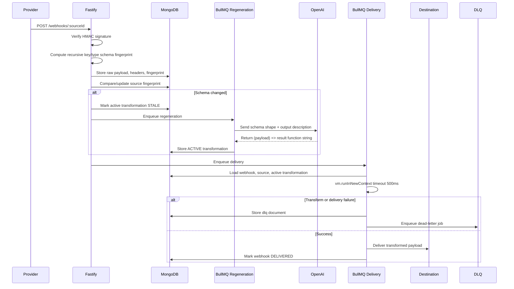

# Hooksmith

Production-ready Webhook Intelligence Engine built with Fastify, MongoDB, Redis, BullMQ, Mongoose, Zod, and the OpenAI Node SDK.

It accepts arbitrary webhook payloads, validates pluggable HMAC signatures, stores raw events, detects schema drift, regenerates JavaScript transformations with GPT-4o-mini, executes transformations in a 500ms VM sandbox, and delivers transformed payloads with retries, decorrelated jitter, and dead letter handling.

## Quick Start

```bash
cp .env.example .env
# edit OPENAI_API_KEY and connector secrets/destinations
docker compose up --build
```

Run sample webhooks:

```bash
bash examples/stripe.sh
bash examples/github.sh
```

## Flow



## Admin API

- `GET /admin/webhooks?sourceId=stripe&from=2026-01-01&to=2026-12-31&limit=50`
- `GET /admin/transformations/:sourceId`
- `POST /admin/webhooks/:id/replay`
- `GET /admin/dlq?limit=50`
- `POST /admin/dlq/:id/replay`

## Writing A Connector

Create a YAML file in `connectors/`:

```yaml
sourceId: my-source
name: My Source
enabled: true
signature:
  strategy: github
  signatureHeader: x-hub-signature-256
  secret: replace_me
outputDescription: >
  Produce the exact normalized object your downstream system expects.
destination:
  url: https://example.com/receive
  method: POST
  headers:
    x-hooksmith-source: my-source
  maxAttempts: 5
  timeoutMs: 10000
connectorVersion: 1.0.0
```

Built-in signature strategies:

- `stripe`: verifies `stripe-signature` using `t.timestamp.v1` semantics.
- `github`: verifies `x-hub-signature-256` using `sha256=<hex>`.
- `shopify`: verifies `x-shopify-hmac-sha256` using base64 HMAC SHA-256.

Connector YAML is loaded at startup with upsert-on-insert semantics. Existing sources are not overwritten, so production secrets and destination edits made in MongoDB remain stable.

## Operational Notes

- Raw payloads and headers are preserved in MongoDB for audit and replay.
- Schema fingerprints are computed from sorted keys and value types only.
- Generated transformation functions are stored in `transformations` with `ACTIVE` or `STALE` status.
- Sandbox execution failures never drop a webhook; they create `dlq` documents and dead-letter queue jobs.
- Delivery uses configurable attempts per destination and decorrelated jitter: `sleep = min(cap, random(base, prev * 3))`.
